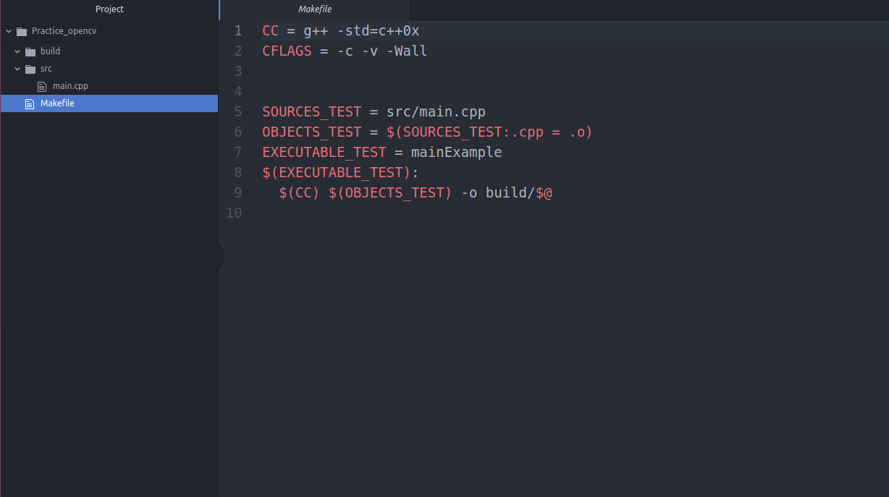
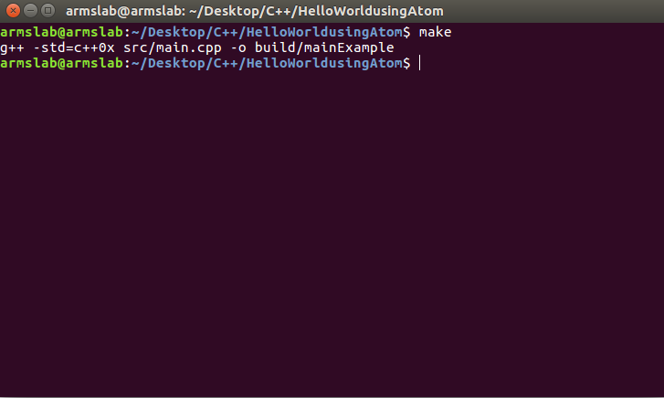
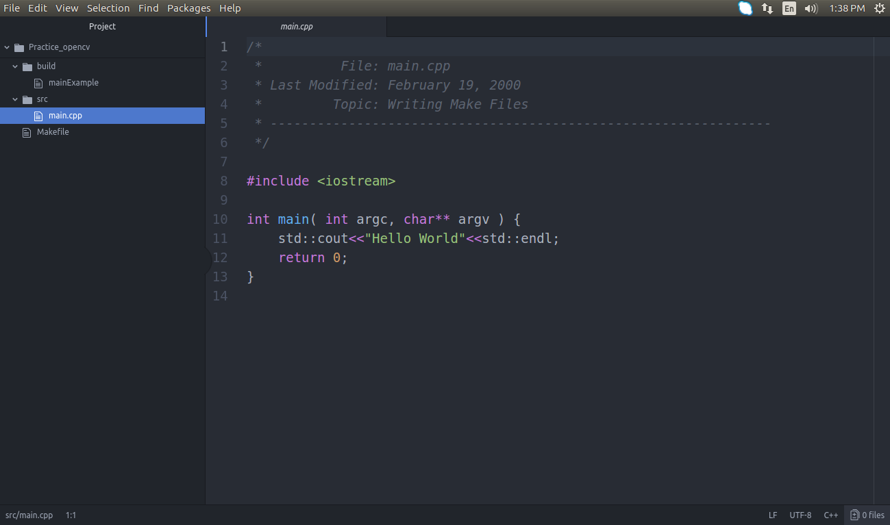
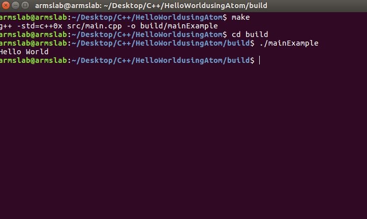

# Hello world program
We use atom editor and Makefile to compile and execute the codes.
The directory structure is:  
**root** 
│   **Makefile** 
└───**src** 
│   **main.cpp**   
└───**build** 
|   **mainExample** 

1. The directory structure in atom is as follows.  
 
2. To compile type `make` in terminal.  
 
3. With sucessful make an executable `mainExample` is created in build folder. 

4. To run the executable type `./mainExample` in terminal. 

