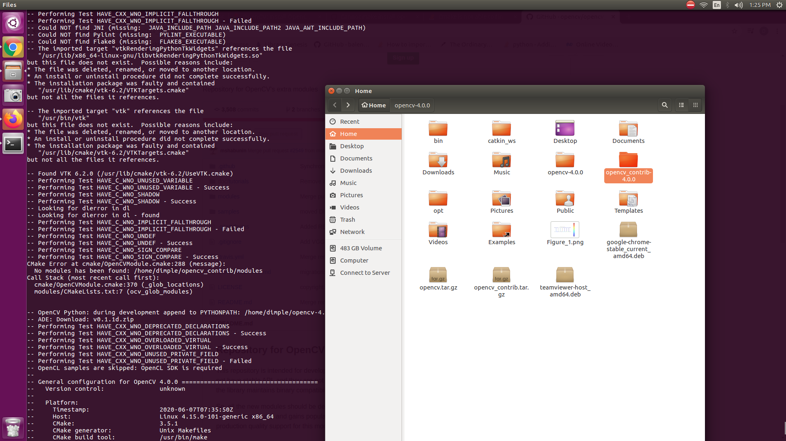
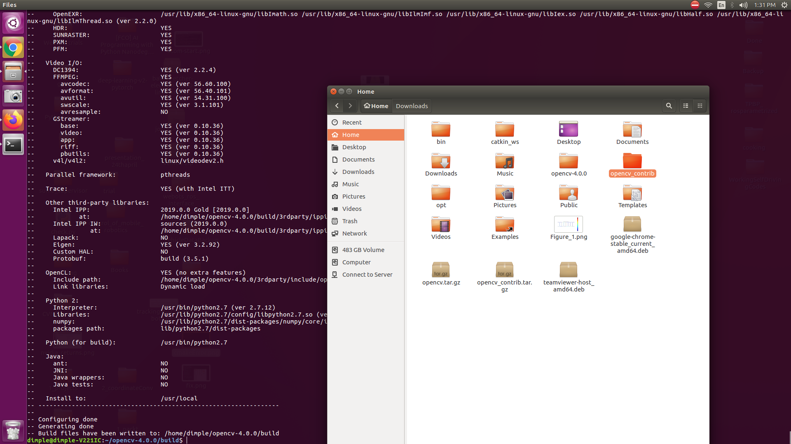

### Install dependancies  
`sudo apt-get -y install libopencv-dev build-essential cmake libdc1394-22 libdc1394-22-dev libjpeg-dev libpng12-dev libtiff5-dev libjasper-dev libavcodec-dev libavformat-dev libswscale-dev libxine2-dev libgstreamer0.10-dev libgstreamer-plugins-base0.10-dev libv4l-dev libtbb-dev libqt4-dev libmp3lame-dev libopencore-amrnb-dev libopencore-amrwb-dev libtheora-dev libvorbis-dev libxvidcore-dev x264 v4l-utils`  

### Download and build opencv4   
`wget "https://github.com/opencv/opencv/archive/4.0.0.tar.gz" -O opencv.tar.gz`  
`wget "https://github.com/opencv/opencv_contrib/archive/4.0.0.tar.gz" -O opencv_contrib.tar.gz `  
`tar -zxvf opencv.tar.gz `  
`tar -zxvf opencv_contrib.tar.gz`  
`cd opencv-4.0.0`  
`mkdir build `  
`cmake -D CMAKE_BUILD_TYPE=RELEASE \  
	-D CMAKE_INSTALL_PREFIX=/usr/local \ 
	-D INSTALL_PYTHON_EXAMPLES=OFF \ 
  	-D PYTHON_INCLUDE_DIR=/usr/include/python2.7  \ 
 	-D PYTHON_LIBRARY=/usr/lib/python2.7/config/libpython2.7.so  \ 
	-D INSTALL_C_EXAMPLES=OFF \ 
	-D OPENCV_ENABLE_NONFREE=ON \ 
	-D OPENCV_EXTRA_MODULES_PATH=~/opencv_contrib/modules \ 
	-D BUILD_EXAMPLES=ON .. `  
``  
See the note below for errors at this step  
`make -j4 ` 
` sudo make install` 

copy the pkgconfig file in opencv.pc to /usr/local/lib/pkgconfig, and name it opencv4.pc: 
`cp /full/path/to/opencv-4.0.0/build/lib/pkgconfig/opencv.pc /usr/local/lib/pkgconfig/opencv4.pc` 

Note: During the build I had cmake error due to contrib path, following is the snapshot of the error  

  
I implemented a simple fix to rename the contrib folder from   
   
to   
   
The cmake did fail few tests but I think it is built correctly. 
